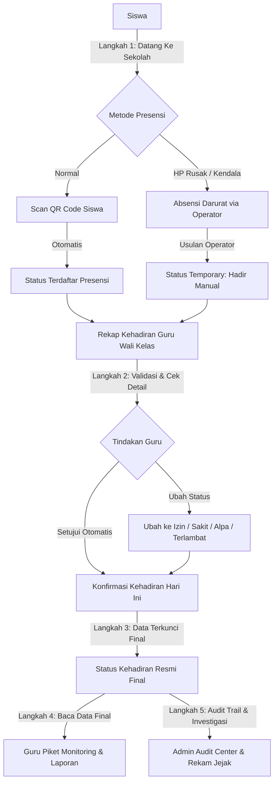

# Sistem Absensi QR Code SMKN 17 JAKARTA

[](https://laravel.com)
[](https://php.net)
[](https://getbootstrap.com)
[](LICENSE)

**Sistem Absensi QR Code SMKN 17 JAKARTA** adalah platform manajemen presensi digital sekolah modern berbasis Web yang dirancang untuk efisiensi, akurasi, dan transparansi pencatatan kehadiran siswa. Sistem ini didukung oleh fitur **Scan QR Code**, prosedur **Absensi Darurat**, **Validasi Bertingkat Guru Wali Kelas**, **Monitoring Real-time Guru Piket**, serta **Pusat Audit Trail Keamanan Admin**.

---

## 📌 Fitur Utama Sistem

1. **Sistem Presensi Utama (Scan QR Code)**:
   - Pencatatan kehadiran instan menggunakan pemindai QR Code bawaan kamera smartphone atau web.
   - Deteksi dan rekapitulasi siswa **Hadir**, **Terlambat**, **Izin**, **Sakit**, dan **Alpa**.
   - Pengaturan jam buka/tutup sesi Scan QR oleh Operator.

2. **Prosedur Absensi Darurat (Emergency Attendance)**:
   - Prosedur penanganan khusus untuk siswa dengan kendala HP rusak/tertinggal, QR Code fisik belum dibagikan, atau gangguan teknis.
   - Pengusulan status sementara **`Hadir Manual`** oleh Operator.
   - Validasi dan penetapan status akhir (*Hadir*, *Izin*, *Sakit*, *Alpa*, *Terlambat*) oleh **Guru Wali Kelas**.

3. **Validasi & Konfirmasi Berantai Guru Wali Kelas**:
   - Guru Wali Kelas memeriksa rekap absensi harian kelasnya.
   - Opsi konfirmasi satu klik **"Konfirmasi Kehadiran Hari Ini"** yang secara otomatis memverifikasi dan mengunci data presensi.

4. **Monitoring & Fitur Reminder Guru Piket**:
   - Monitoring progres konfirmasi kehadiran seluruh kelas secara real-time.
   - **Isolasi Data Final**: Guru Piket hanya membaca data presensi yang telah disahkan/dikunci oleh Guru Wali Kelas.
   - Fitur **Pengingat (Reminder)** internal via Mailbox untuk memberitahu Guru Wali Kelas yang belum melakukan konfirmasi.

5. **Kotak Surat Internal (Mailbox)**:
   - Sistem komunikasi internal tanpa mengandalkan SMS/Email/WhatsApp external.
   - Pengiriman surat teguran/pemberitahuan ke akun Siswa dan pengingat ke Guru.

6. **Audit Center & Keamanan Berlapis (Admin)**:
   - Log Aktivitas detail dan Riwayat Login (*IP Address*, *Browser*, *Device*, *Timestamp*).
   - Pusat Audit Absensi Darurat dengan rekam jejak histori perubahan.
   - Proteksi **Security Headers**, **Intrusion Detection System (IDS)**, **IP Blocking**, dan **CSRF**.
   - Ekspor Laporan Resmi dalam format **PDF**, **Excel (.xlsx)**, dan **CSV**.

---

## 🔄 Alur Standar Operasional Prosedur (SOP Final)



---

## 👥 Hak Akses & Peran Pengguna (RBAC)

| Peran (Role) | Hak Akses Utama & Tugas |
| :--- | :--- |
| **Administrator (`admin`)** | Kelola data master (Guru, Siswa, Kelas, Operator, Guru Piket), QR Code Siswa, Audit Center Absensi Darurat, Security Center, Activity Log, Riwayat Login, dan Laporan Utama. Access Level: Full Access / Read-Only Audit. |
| **Guru Wali Kelas (`teacher`)** | Melakukan Scan QR kelas, input keterlambatan, memvalidasi status **Hadir Manual**, menetapkan status akhir, dan mengunci presensi via **"Konfirmasi Kehadiran Hari Ini"**. |
| **Operator Operasional (`operator`)** | Membuka/menutup sesi Scan QR sekolah, mencatat siswa terlambat, dan menginput **Absensi Darurat** (*Status Temporary: Hadir Manual*). |
| **Guru Piket (`piket`)** | Memonitor status konfirmasi seluruh kelas harian (Read-Only Data Final), mengirim **Reminder Internal**, dan mencetak Laporan Absensi Sekolah. |
| **Siswa (`student`)** | Menampilkan QR Code pribadi, melihat riwayat kehadiran mandiri, dan menerima pesan **Kotak Surat**. |

---

## 🛠️ Persyaratan Sistem

- **PHP**: `>= 8.1`
- **Laravel Framework**: `10.x`
- **Database**: MySQL `>= 8.0` atau MariaDB `>= 10.4`
- **PHP Extensions Wajib**: `OpenSSL`, `PDO`, `Mbstring`, `Tokenizer`, `XML`, `Ctype`, `JSON`, `BCMath`, `GD` / `Imagick`

---

## ⚙️ Cara Instalasi & Menjalankan Project

1. **Clone Repository / Ekstrak Source Code**:
   ```bash
   git clone https://github.com/smkn17jakarta/absensi-qr.git
   cd absensi-qr
   ```

2. **Install Dependensi Composer**:
   ```bash
   composer install
   ```

3. **Konfigurasi Lingkungan (`.env`)**:
   Salin `.env.example` menjadi `.env`:
   ```bash
   cp .env.example .env
   ```
   Sesuaikan konfigurasi database pada `.env`:
   ```env
   DB_CONNECTION=mysql
   DB_HOST=127.0.0.1
   DB_PORT=3306
   DB_DATABASE=absensi_qr
   DB_USERNAME=root
   DB_PASSWORD=
   ```

4. **Generate Application Key**:
   ```bash
   php artisan key:generate
   ```

5. **Jalankan Migrasi Database & Seeder**:
   ```bash
   php artisan migrate:fresh --seed
   ```

6. **Buat Symlink Storage**:
   ```bash
   php artisan storage:link
   ```

7. **Jalankan Server Lokal**:
   ```bash
   php artisan serve
   ```
   Buka peramban di `http://127.0.0.1:8000`.

---

## 🔑 Kredensial Login Default (Testing & Seeder)

> **Catatan Keamanan**: Harap segera ubah kata sandi pengguna default setelah penyebaran di lingkungan produksi.

| Role | Username | Password | Keterangan |
| :--- | :--- | :--- | :--- |
| **Admin** | `admin` | `password` | Administrator Utama |
| **Guru Wali Kelas** | `guru` | `password` | Wali Kelas XII RPL 1 |
| **Operator** | `operator` | `password` | Petugas Gerbang / Operator |
| **Guru Piket** | `piket` | `password` | Guru Piket Harian |
| **Siswa** | `siswa` | `password` | Siswa XII RPL 1 |

---

## 🔒 Keamanan & Optimasi Performa

- **Anti-XSS & SQL Injection Protection**: Dilengkapi dengan `IntrusionDetectionMiddleware` dan pembersihan karakter berbahaya.
- **CSRF Token**: Diwajibkan pada seluruh permintaan data yang memodifikasi state (`POST`/`PUT`/`DELETE`).
- **Eager Loading Optimization**: Bebas dari *N+1 Query Issue* untuk performa render cepat.
- **Responsive & Touch Friendly**: Antarmuka Bootstrap 5 disesuaikan penuh untuk pengguna Smartphone, Tablet, Laptop, dan PC Desktop.

---

## 📄 Lisensi & Hak Cipta

© **SMKN 17 JAKARTA** — Seluruh Hak Cipta Dilindungi Undang-Undang.  
Dikembangkan untuk operasional presensi digital resmi SMKN 17 Jakarta.
